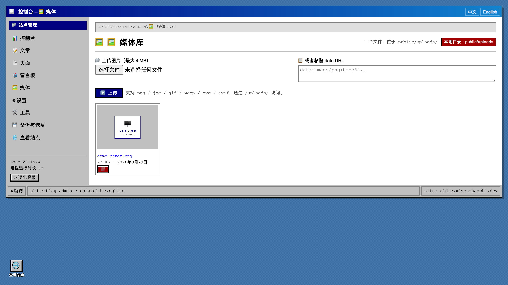
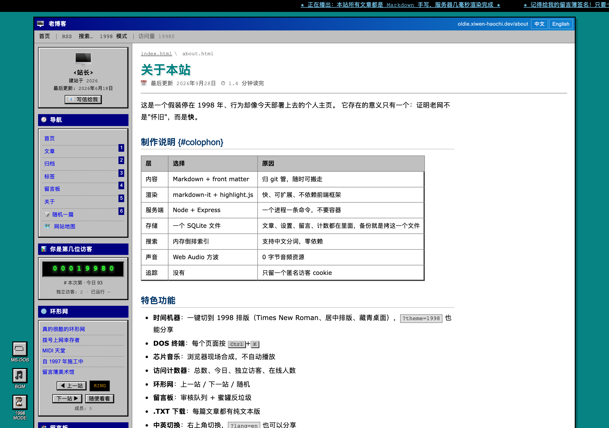

<div align="center">


**老博客 / oldie-blog** — 一个 1990 年代风格的个人博客。

Markdown 写作，服务端渲染，带管理后台、全文搜索和一套完整的 SEO。

[English](README.md) · [简体中文](README.zh-CN.md)

[](https://nodejs.org)


</div>

---

## 这是什么

一个单进程的 Node 博客程序。文章、页面、设置、留言、访问计数和会话都写在
`data/oldie.sqlite` 这一个文件里；运行时依赖一共六个，装完就能跑，没有构建步骤。

界面是 1990 年代个人主页的样子 —— webring、留言簿、访问计数器、每页都有的 DOS 终端，
以及一键把整站切回 1998 年的模式。页面本身是普通的服务端渲染：没有 hydration，
没有前端框架，也没有一整套构建工具链。

| | |
| --- | --- |
|  |  |
| 文章列表 | 一篇文章 |

### 后台

| | |
| --- | --- |
|  |  |
| 控制台：流量、SEO 自检、审核队列 | 编辑器：左边写，右边实时预览 |

| | |
| --- | --- |
|  |  |
| 设置：功能开关、存储方式、站点信息 | 媒体库：上传的图片 |

| | |
| --- | --- |
|  |  |
| 备份：整站打成一个 `.zip` | 后台的地址可以自己改 |

### 其他页面

| | |
| --- | --- |
|  |  |
| 留言簿：签名，带审核 | 搜索：支持中文，支持 `tag:` |

|  |  |
| 1998 模式 | 关于页 |

---

## 快速开始

```bash
git clone git@github.com:xiwen-haochi/oldie-blog.git
cd oldie-blog

nvm use            # 推荐 Node 24（.nvmrc 已经提交）
pnpm install
pnpm start         # → http://localhost:4173
```

第一次启动会在终端打印一个临时后台密码，登录 `/admin` 之后到「设置 → 密码」改掉。

想先看看长什么样：

```bash
pnpm seed          # 五篇示例文章、一个留言簿、一个访问计数器
```

---

## 部署

### Docker

```bash
cp .env.example .env      # 填 ADMIN_PASSWORD 和 SITE_URL
docker compose up -d
```

文章、计数器和设置都放在命名卷里，重建镜像不会丢。`/healthz` 供容器健康检查使用。

### 从 GitHub 自动构建

每次推送 `main` 都会跑测试，并把镜像构建到 GitHub Container Registry：

```bash
docker pull ghcr.io/xiwen-haochi/oldie-blog:latest
```

`.github/workflows/ci.yml` 还会跑 `scripts/check-secrets.mjs`，一旦有敏感文件要被提交就让构建失败。

> **第一次构建后要做一件事**：GitHub 的镜像包不会跟着仓库自动变公开。
> 打开 [Packages](https://github.com/xiwen-haochi/oldie-blog/packages) → `oldie-blog` →
> **Package settings** → **Change visibility** → **Public**。

### 后台密码

第一次启动时应用会做两件事之一：

- 设了 `ADMIN_PASSWORD` 环境变量 → 用它，并且只在这一次生效
- 没设 → 随机生成一个，打印在启动日志里

```
┌─ first run ─────────────────────────────────────────────┐
│ admin user : admin                                     │
│ temp pass  : xxxxxxxxxxxxx                             │
└──────────────────────────────────────────────────────────┘
```

**在哪看那行日志**：服务页面 → **Console** 标签页 → 往回翻到第一次启动。

**改密码**：登录后 → **设置 → 密码** → 填当前密码和新密码。

改完之后 `ADMIN_PASSWORD` 就可以删掉了 —— 它只管首次启动，之后你设的密码说了算，重启也不会被冲掉。

在容器里改（Railway 的 Console 没有 shell，得用 SSH 或者在本地跑）：

```bash
docker compose exec blog node scripts/reset-admin.js   # 用 compose 部署时
docker exec -it <容器名> node scripts/reset-admin.js    # 其他平台同理
```

镜像里带了 `scripts/`，所以重置密码、新建文章（`new-post.js`）、
灌演示数据（`seed-demo.js`）都能直接在容器里跑；测试脚本和测试文件不进镜像。

### Railway

1. **New Project → Deploy from GitHub repo**，选 `xiwen-haochi/oldie-blog`。
   Railway 会自己读 `Dockerfile` 构建。

2. **挂一个卷，路径填 `/app/data`。** Railway 的文件系统是临时的，重新部署会清空；
   整站的数据就在这一个文件里。

   | 挂在 | 里面是什么 | 不挂会怎样 |
   | --- | --- | --- |
   | `/app/data` | `oldie.sqlite`：设置、全部文章和页面、留言、订阅者、会话 | **下一次重新部署，整站清空** |

   `config/` 和 `content/` 不用挂：`site.config.json` 只在第一次启动读一次，
   `content/` 里的 `.md` 也只在第一次启动导入。

3. **设三个环境变量**（Variables 标签页）：

   | 变量 | 值 | 不设会怎样 |
   | --- | --- | --- |
   | `ADMIN_PASSWORD` | 你自己定一个长密码 | 启动时打印随机密码，重启就变 |
   | `SESSION_SECRET` | 一串随机字符 | 每次重启所有人都得重新登录 |
   | `SITE_URL` | Railway 给你的域名 | canonical、订阅源、站点地图全错，SEO 废掉 |

   端口不用管，Railway 会注入 `PORT`，应用自己读。

部署成功后 Railway 会给一个 `*.up.railway.app` 的地址，在 **Settings → Networking** 里
可以换成自己的域名。

> Railway 免费额度会在闲置时休眠，冷启动要等十几秒。

### 裸机

```bash
git clone … && cd oldie-blog && pnpm install
NODE_ENV=production ADMIN_PASSWORD='…' SITE_URL='https://你的域名' \
  node src/server.js
```

前面套 nginx 或 Caddy 做 TLS。反代后面把 `HOST` 设成 `127.0.0.1` —— 应用只说 HTTP，不自己跳转。

### 环境变量

| 变量 | 默认值 | 作用 |
| --- | --- | --- |
| `SITE_URL` | `http://localhost:4173` | canonical、订阅源、站点地图 |
| `HOST` / `PORT` | `127.0.0.1` / `4173` | 监听地址 |
| `ADMIN_USER` / `ADMIN_PASSWORD` | `admin` / 自动生成 | 首次启动的凭据 |
| `SESSION_SECRET` | 自动生成 | 签名会话 cookie；设了才能跨重启保持登录 |
| `NODE_ENV` | — | `production` 会给静态资源开长缓存 |

---

## 写文章

### 在后台

```
① 打开  http://你的域名/admin/posts/new

② 标题

③ 正文   —— 左边 Markdown，右边实时预览
           工具栏上有 B / I / 标题 / 引用 / 链接 / 图片 / 代码块

④ 右边填可选信息
      · 标签      逗号分隔，会生成标签页
      · 描述      留空自动取正文开头，同时用作 SEO 和订阅源摘要
      · 封面图    从媒体库选，或者填 /uploads/xxx.png

⑤ 点「保存」      → 立刻发布，全站可见
   勾「草稿」再存  → 只有你自己看得到
   勾「置顶」再存  → 排在所有文章最前面
```


**改已经发布的**：后台左侧「文章」→ 点标题 → 改完再保存。
**删掉**：同一行的删除按钮。

**图片**：直接把文件拖进正文框，或者在「媒体」页上传，然后写 ``。

**想撤销？** 后台的自动保存只存在浏览器里，关掉页面就没了。
已经发布的文章在数据库里，**备份与恢复**导出的 `.zip` 就是它的备份。

### 命令行

```bash
pnpm new:post "标题" --tags=随笔,工具 --draft
pnpm clean          # 清空文章、页面、留言和计数，重新开始
```

会在数据库里建好这篇文章，然后去后台接着写。习惯终端的话还有 `seed-demo.js` 可以灌演示数据。

### Markdown 文件

文章平时存在数据库里。只有两个地方会碰到 `.md` 文件：

- **备份**会额外导出一份，方便自己翻
- **全新安装**会把 `content/posts/` 和 `content/pages/` 下找到的 `.md` 导入进来

文件格式就这些：

```markdown
---
title: "标题"              # 必填
date: 2026-09-29           # 必填，决定排序
description: "一句话摘要"  # 选填，留空自动取正文开头
tags: [随笔, 工具]          # 选填，逗号分隔也行
featured: true             # 选填，置顶
draft: true                # 选填，草稿不公开
cover: /uploads/x.png      # 选填，封面图
---

正文是标准 Markdown。
```

### 推送到 GitHub 会发生什么

| | |
| --- | --- |
| 代码改动 | 会推上去，CI 重跑测试、重新构建镜像 |
| **你的文章** | **不会推上去** |
| **后台密码** | **不会推上去** |
| 留言、访问量、设置 | **不会推上去** |

`content/`、`data/`、`config/admin.json` 和 `public/uploads/` 都在 `.gitignore` 里。
所以别人 clone 你的仓库，拿到的是一个空站；想在另一台机器上跑同一个站，
用后台的「备份与恢复」导出一个 `.zip` 拿去那边导入。
**git 管代码，`.zip` 管内容。**

### 那部署在哪

GitHub 本身不能直接跑这个博客 —— 它需要常驻的 Node 进程和一块可写磁盘，
而 GitHub Pages 只能托管静态文件。推代码不等于网站上线。

要一个真正的地址，选一个能挂持久磁盘的平台（Railway / Render / Fly.io / 自己的服务器），
用上面那份 `docker-compose.yml` 起就行。

---

## 数据和备份

| 位置 | 放什么 | 会发布吗 |
| --- | --- | --- |
| `data/oldie.sqlite` | 文章、页面、设置、留言、访问计数、会话 | 否 |
| `config/admin.json` | 后台密码（scrypt 哈希） | 否 |
| `public/uploads/` | 你上传的图片 | 否 |
| `content/` | 首次启动导入用、备份导出用 | 否 |
| `config/site.config.json` | 站名、导航、webring 名字 | 是，页面要用 |

**备份**在后台一键完成：打成一个 `.zip`，包含数据库、图片和配置。
恢复的时候旧数据先挪走而不是删掉，所以操作可以反悔。

> 文章是数据库里的记录，不是能直接 `git diff` 的纯文本文件。
> 换来的是备份只有一样东西、换服务器只需要拷一样东西。
> 想要纯文本，备份包里就有。

---

## 功能

**写作** —— Markdown 加 front matter，实时预览，草稿，置顶，标签，每篇单独的 SEO 字段，
自动目录。粘贴的 HTML 会过一遍白名单：`style`、内联背景、事件处理器会被去掉，
表格和内联 SVG 保留。

**阅读** —— 懂中文的全文搜索（unigram + bigram）、归档、标签页、阅读时长，
每篇文章都能下载成 `.txt` 或 `.json`。

**1990 年代** —— 带邻居的 webring、要审核的留言簿、访问计数器、走马灯、闪烁文字、
每页都有的 DOS 终端（<kbd>Ctrl</kbd>+<kbd>K</kbd>）、浏览器里合成的芯片音乐，
以及一键切回 1998 年的模式。

**SEO 和安全** —— RSS / Atom / JSON Feed、`sitemap.xml`、JSON-LD、`llms.txt`、
Open Graph、hreflang 多语言。后台路径可以自己配，不出现在任何公开页面里；
密码用 scrypt，会话 cookie 签名，表单带 CSRF，登录有限流，每次请求过一遍 HTML 消毒。

**可开关** —— 评论、评论审核、留言簿、搜索、访问计数器、随机文章、目录、阅读时长，
后台里各有一个开关。

---

## 开发

```bash
pnpm test          # 206 个单元测试 + 77 项端到端检查
pnpm test:unit
pnpm test:e2e
pnpm dev           # node --watch
node scripts/check-secrets.mjs
```

运行时依赖只有六个：`express`、`ejs`、`markdown-it`、`highlight.js`、`gray-matter`、`multer`。
搜索索引、会话、gzip、S3 签名和 ZIP 打包都在 `src/lib` 里，没有编译器也没有原生模块，
新克隆 `pnpm install` 几秒就完。

端到端测试在临时数据目录里跑一个真实服务器，碰不到你自己的文章和计数。

---

## 许可

MIT，见 [LICENSE](LICENSE)。
