<div align="center">

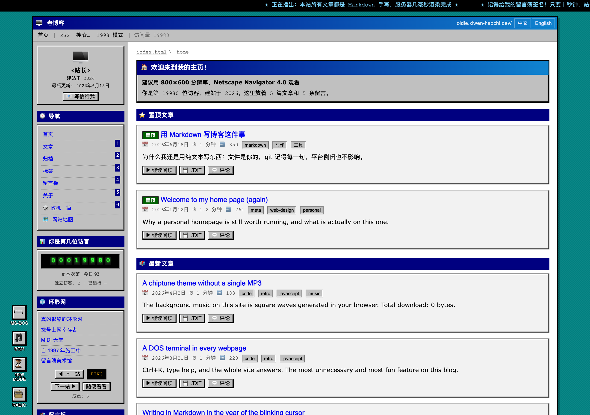

**老博客 / oldie-blog** —— 一个活过 dot-com 寒冬的 1990 年代个人主页。
Markdown 写内容，服务端渲染出 HTML，webring、留言簿、角落里的 DOS 终端，
底下是一套完整的 SEO。

[English](README.md) · [简体中文](README.zh-CN.md)

[](https://nodejs.org)


</div>

---

## 这是什么

一个打扮成 1996 年 GeoCities 页面的博客引擎。怀旧的是界面，底下是正经的服务端渲染博客：
文章就是磁盘上的 Markdown 文件，后台是真的，SEO 是完整的。

| | |
| --- | --- |
| 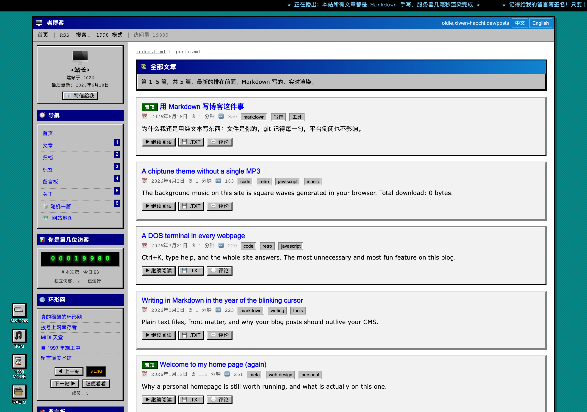 | 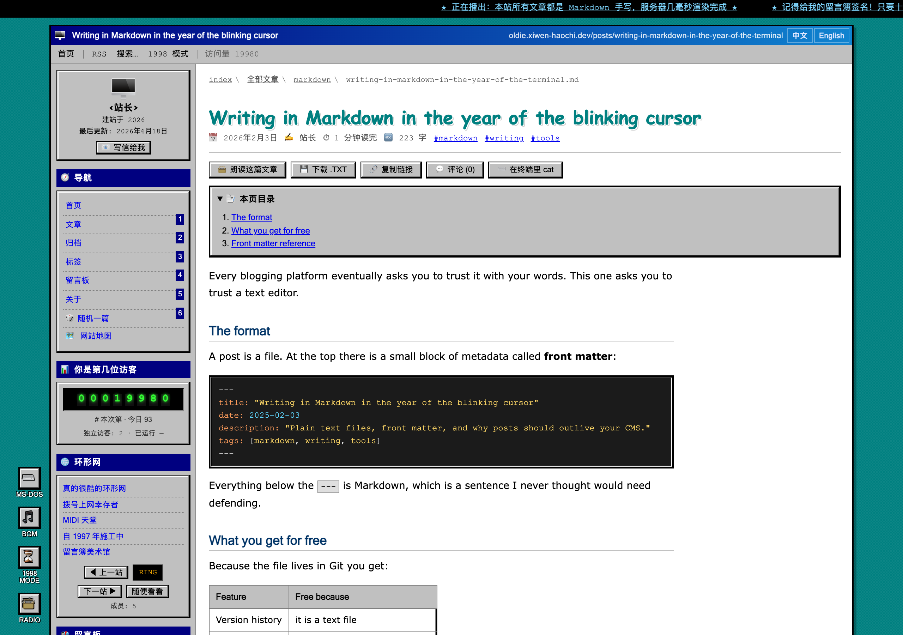 |
| **首页** —— 置顶文章 + 最新文章 | **文章** —— 每一页都是一个 `.md` 文件 |

### 后台

| | |
| --- | --- |
| 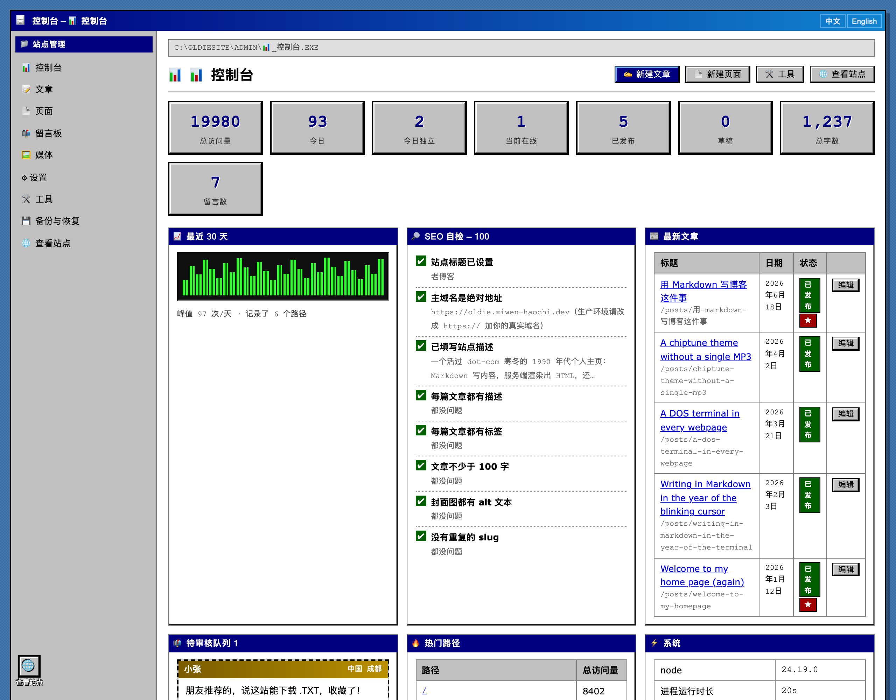 | 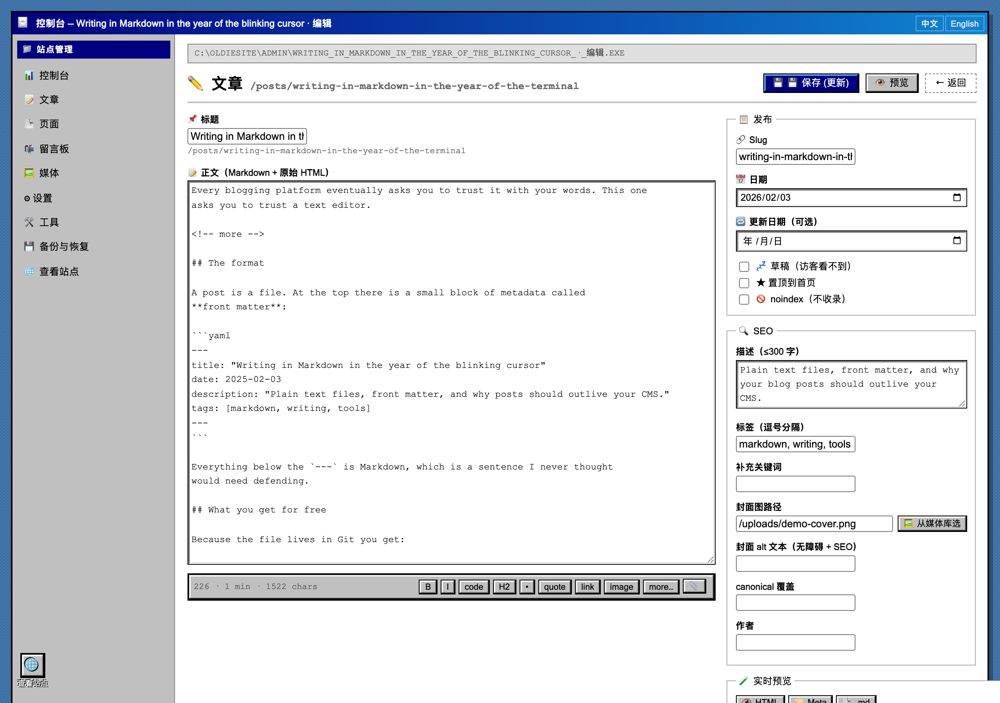 |
| **控制台** —— 流量、SEO 自检、审核队列 | **编辑器** —— Markdown + 实时预览 |

| | |
| --- | --- |
| 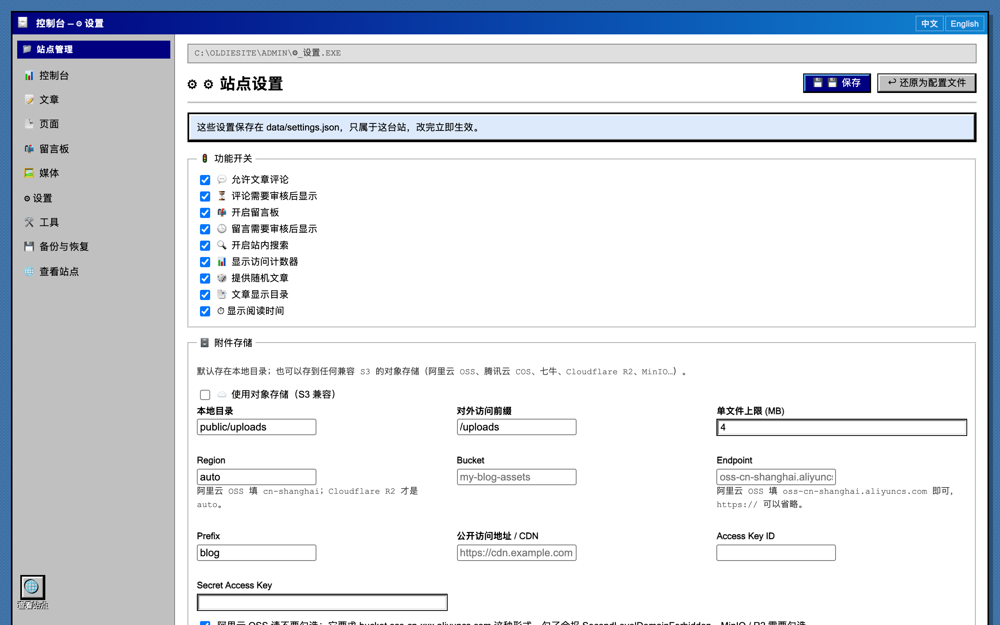 | 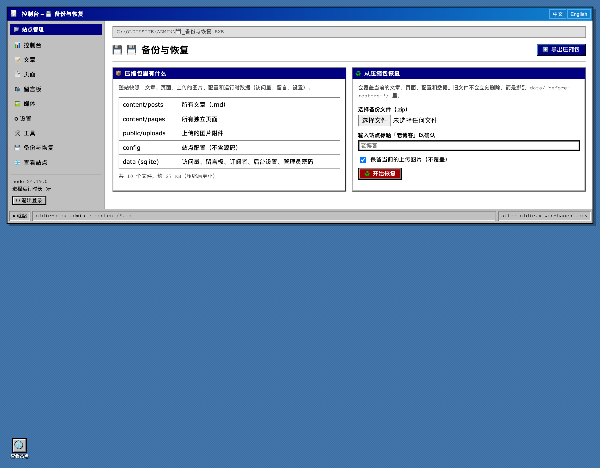 |
| **设置** —— 功能开关、存储驱动、附件 | **备份** —— 整站打成一个 `.zip` |

### 其他

| | |
| --- | --- |
| 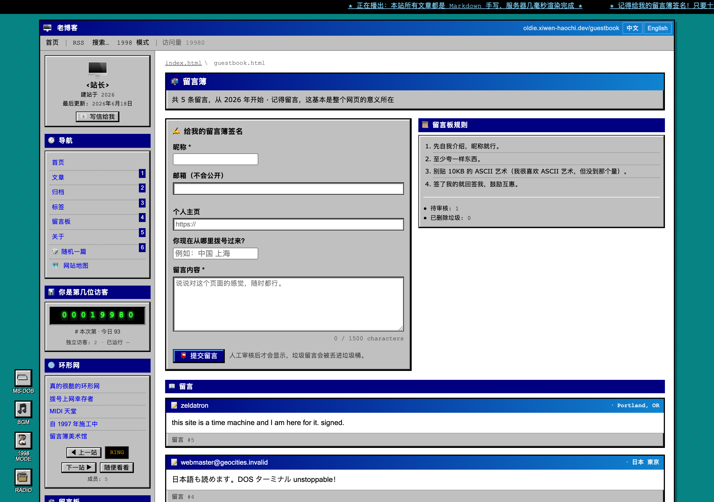 | 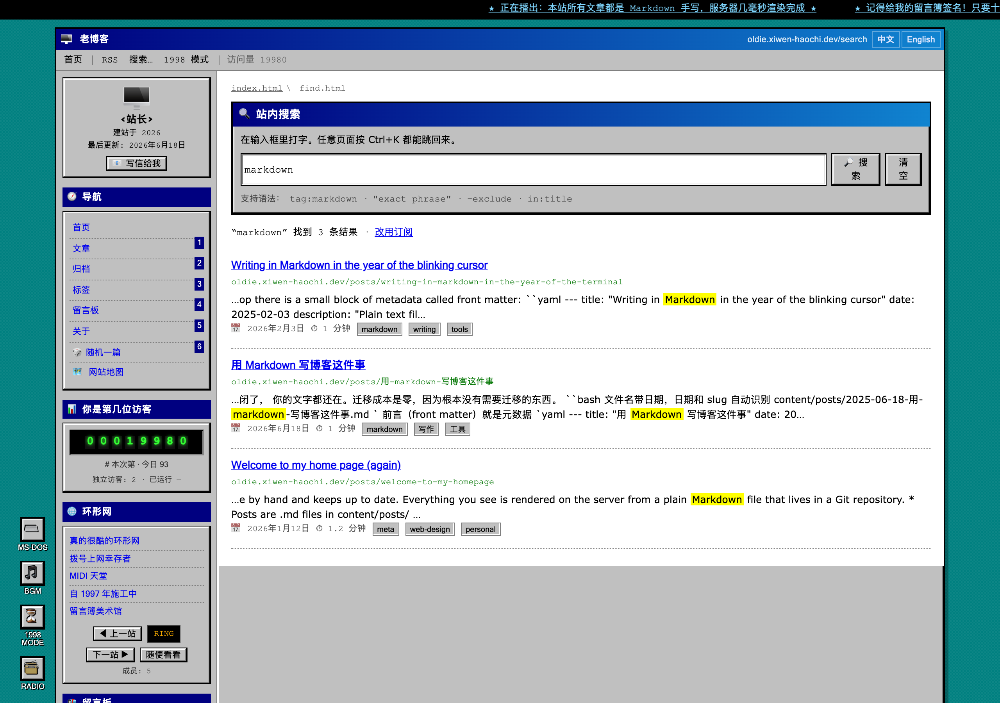 |
| **留言簿** —— 签名，带审核 | **搜索** —— 支持中文，支持 `tag:` |

| 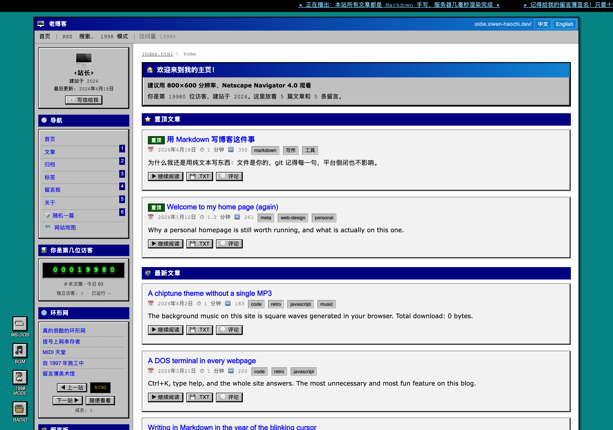 | 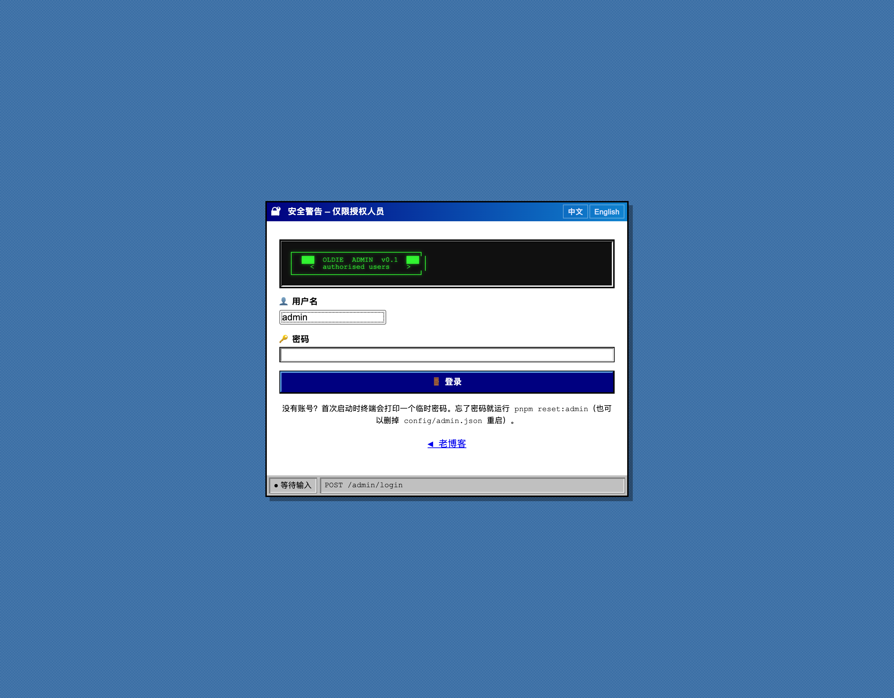 |
| **1998 模式** —— 一键把整站倒回过去 | 后台从不出现在任何公开页面 |

---

## 快速开始

```bash
git clone git@github.com:xiwen-haochi/oldie-blog.git
cd oldie-blog

nvm use            # 推荐 Node 24（.nvmrc 已经提交）
pnpm install
pnpm start         # → http://localhost:4173
```

第一次启动会在终端打印一个临时密码，登录 `/admin` 后到「设置 → 密码」改掉。

想先看看长什么样：

```bash
pnpm seed          # 五篇示例文章、一个留言簿、一个计数器
```

---

## 部署

### 一条命令（Docker）

```bash
cp .env.example .env      # 填 ADMIN_PASSWORD 和 SITE_URL
docker compose up -d
```

文章、计数器和设置都放在**命名卷**里，重建镜像不会丢。`/healthz` 供容器健康检查使用。

### 从 GitHub 自动构建

每次推送 `main` 都会跑测试并把镜像构建到 GitHub Container Registry：

```bash
docker pull ghcr.io/xiwen-haochi/oldie-blog:latest
```

`.github/workflows/ci.yml` 还会跑 `scripts/check-secrets.mjs`，一旦有敏感文件要被提交就直接让构建失败。

> **第一次构建后要做一件事**：GitHub 的镜像包**不会**跟着仓库自动变公开。
> 打开 [Packages](https://github.com/xiwen-haochi/oldie-blog/packages) → `oldie-blog` →
> **Package settings** → **Change visibility** → **Public**。
> 不做这一步，别人 `docker pull` 会收到 401。

### 裸机部署

```bash
git clone … && cd oldie-blog && pnpm install
NODE_ENV=production ADMIN_PASSWORD='…' SITE_URL='https://你的域名' \
  node src/server.js
```

前面套 nginx 或 Caddy 做 TLS。反代后面把 `HOST` 设成 `127.0.0.1` —— 应用只说 HTTP，不自己跳转。

### 环境变量

| 变量 | 默认值 | 作用 |
| --- | --- | --- |
| `SITE_URL` | `http://localhost:4173` | canonical、订阅源、站点地图 |
| `HOST` / `PORT` | `127.0.0.1` / `4173` | 监听地址 |
| `ADMIN_USER` / `ADMIN_PASSWORD` | `admin` / 自动生成 | 首次启动的凭据 |
| `SESSION_SECRET` | 自动生成 | 签名会话 cookie；设了才能跨重启保持登录 |
| `NODE_ENV` | — | `production` 会给静态资源开长缓存 |

---

## 发新文章的流程

三种写法，选一种就行。**它们最终都是往 `content/posts/` 里写一个 `.md` 文件。**

### 1. 在后台写（最常用）

```
1. 打开 /admin/posts/new
2. 填标题，正文框里写 Markdown，右下角有实时预览
3. 需要的话填标签（逗号分隔）、描述（留空会自动截取正文）
4. 点「保存」发布，或先勾「草稿」存着不发
```

保存后立刻出现在首页。想让它排前面，勾「置顶到首页」—— 置顶区按**置顶时间**排序，
所以把一篇老文章重新勾一次置顶，它会跳到最上面。

改已发布的文章：/admin 左侧「文章」→ 点标题进编辑页。
删文章：文章列表右侧的删除按钮。

### 2. 命令行（带模板）

```bash
pnpm new:post "标题" --tags=随笔,工具 --draft
```

会在 `content/posts/` 里生成一个带 front matter 的文件，直接用编辑器写。
省略 `--draft` 就是已发布。

### 3. 任何编辑器 + git

```bash
vim content/posts/2026-09-29-my-post.md
```

文件格式就这些：

```markdown
---
title: "标题"              # 必填
date: 2026-09-29           # 必填，决定排序
description: "一句话摘要"  # 选填，留空自动取正文前 140 字
tags: [随笔, 工具]          # 选填，逗号分隔也行
featured: true             # 选填，置顶
draft: true                # 选填，草稿不公开
cover: /uploads/x.png      # 选填，封面图
---

正文是标准 Markdown。
```

**存盘即生效** —— 服务端会监听这个目录，改完刷新页面就能看到。

### 图片怎么办

后台「媒体」页拖进来，或者直接把图片拖进正文框。
也可以写到任何地方再引用：

```markdown

```

### 常见问题

| 现象 | 原因 |
| --- | --- |
| 存了但页面没变 | 看一眼文件是不是 `.md`、是不是在 `content/posts/` |
| 列表里看不到 | 检查 `draft: true` |
| 中文标题 URL 难看 | 在后台编辑页手动改「Slug」字段 |
| 想撤销修改 | 文章都在磁盘上，`git checkout content/posts/` 就行 |

## 你的文章是数据，不是代码

这是大部分博客引擎做错的地方。这里：

- 文章是 `content/posts/*.md`，用任何编辑器、任何 git 操作都行
- `content/`、`data/`、`config/admin.json` **都在 .gitignore 里**，永远不会被发布
- 新克隆是空的；`pnpm seed` 给你示例内容看看

```bash
pnpm new:post "第一篇" --tags=随笔 --draft
pnpm clean          # 清空文章、页面、留言和计数，重新开始
```

### 东西都放哪

| 位置 | 放什么 | 会发布吗 |
| --- | --- | --- |
| `content/posts/*.md` | 你的文章 | ❌ 这是你的东西 |
| `content/pages/*.md` | 独立页面 | ❌ |
| `data/` | 访问量、留言簿、订阅者、会话、设置 | ❌ |
| `config/admin.json` | 管理员密码（scrypt） | ❌ |
| `config/site.config.json` | 站名、导航、webring 名字 | ✅ 这是故意的 |
| `public/uploads/` | 你上传的图片 | ❌ |

**备份**在后台一键完成：打成一个 `.zip`，包含文章、上传、配置和运行时数据。
恢复时旧文件是先挪走而不是删除，所以操作永远可逆。

---

## 功能

**写作** —— Markdown + front matter，实时预览，草稿，置顶，标签，单篇 SEO，目录。
可以直接粘贴 HTML，但会被消毒：`style`、内联背景、事件处理器一律去掉，表格和内联 SVG 保留。

**阅读** —— 懂中文的全文搜索（unigram + bigram），归档，标签页，阅读时长，
每篇文章都能下载成 `.txt` 或 `.json`。

**1990 年代** —— 带邻居站的 webring，要审核的留言簿，访问计数器，走马灯，闪烁文字，
每页都有 DOS 终端（<kbd>Ctrl</kbd>+<kbd>K</kbd>），浏览器里合成的芯片音乐，
还有一键**倒回 1998** 的模式。

**正经的部分** —— RSS/Atom/JSON Feed、`sitemap.xml`、JSON-LD、`llms.txt`、Open Graph、
hreflang 多语言、可配置且从不对外宣传的后台路径、scrypt 密码、签名会话、CSRF、登录限流、
逐请求的 HTML 消毒。

**可开关** —— 评论、评论审核、留言簿、搜索、访问计数器、随机文章、目录、阅读时长，
后台里各有一个开关。

---

## 为什么只有六个依赖

运行时依赖只有 `express`、`ejs`、`markdown-it`、`highlight.js`、`gray-matter`、`multer`，
其余都在 `src/lib` 里自己写：

| 不用 | 换成了 |
| --- | --- |
| 搜索库 | 支持中文的倒排索引，约 200 行 |
| session 库 | HMAC 签名 cookie，约 80 行 |
| `bcrypt` | `node:crypto` 的 `scrypt` |
| 压缩库 | 手写的 gzip 中间件 |
| S3 SDK | 基于 `fetch` 的 SigV4 签名 |
| ZIP 库 | 自己写的 deflate/store 打包与解包 |
| HTML 消毒库 | 白名单消毒器 |

没有编译器，没有 `node-gyp`，新克隆不会卡在原生模块上。`pnpm install` 几秒就完。

---

## 开发

```bash
pnpm test          # 149 个单元测试 + 60 项针对真实服务器的端到端检查
pnpm test:unit
pnpm test:e2e
pnpm dev           # node --watch
node scripts/check-secrets.mjs
```

端到端测试在临时数据目录里跑一个真实服务器，**碰不到**你自己的文章和计数。

---

## 许可

MIT，见 [LICENSE](LICENSE)。
